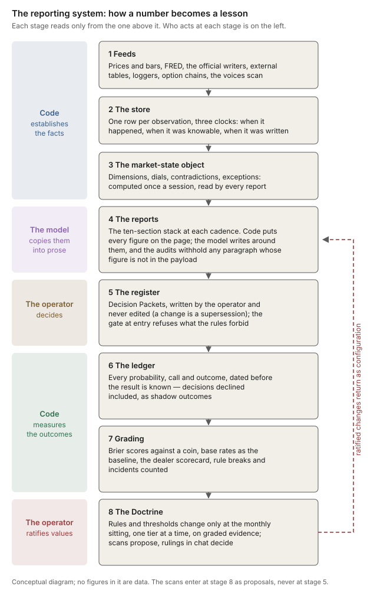

# The Reporting System: A Reader's Guide

## What Each Report Is, Where Its Numbers Come From, What It May Say, and How It Learns

**Companion white paper — chester-reports library**
**Series placement:** Companion **XXXIII** — System shelf, after *The Operating Doctrine* and *Building and Validating a Systematic Book*, per the library guide. Cross-references in this paper are by name.
**Version:** Draft 2 — 9 October 2026 (Draft 1, 6 October 2026, described the Monthly before it joined the stack)
**Status:** As-built. Describes the system as the code stands on the day of writing, says plainly what is specified but not built, and keeps every timer, threshold, budget and source count in the dated Appendix A. Appendix D records what became of each place where Draft 1 found the commissioning brief disagreeing with the code. Reread when the intraday layer is built, after the first stacked Monthly, and at each Audit.

---

### Reader's note

This paper is for the operator: the one person who reads every report, takes every decision and rules on every change. It is meant to be read once from start to finish, on a phone or at a desk, and then consulted when a report prints something unfamiliar. It answers four questions about every report the system produces: what the report is, where its numbers come from, what it may and may not say, and how the system learns from what it said.

The other papers on this shelf describe one machine each. The Daily Cascade paper is the field guide to the daily sections; the Monthly manual covers the macro pillars; the Systematic Book paper describes the register and the broker connection as they were built; the Operating Doctrine says what the operator is to do. This paper sits above them and explains how the pieces fit: how a number travels from a public website into the store, from the store into one shared description of the market, from that description into a report, from the report into a decision, and from the decision into a graded record that eventually changes the rules. Figure 1 draws that path; the ten Parts walk it.

Three conventions run through the paper. First, nothing here is a market view. The paper describes machinery; the reports carry the readings. Second, the body is timeless. Anything that will change with the next configuration edit, such as a timer, a threshold, a word budget or the number of sources, sits in Appendix A with the date it was true. Third, where a capability is specified but not yet built, the paper says so in the sentence that describes it. A guide that describes the intended system as if it were running is the most dangerous kind of documentation, because it is the kind a reader trusts.

**Prerequisites.** None beyond the Operating Doctrine's first three Parts, which explain the books and the dials. The Dealer's Hand teaches the options mechanics behind the dealer-positioning figures; Base Rates and Evidence and Inference teach the statistics behind the grading. This paper uses their results and does not re-derive them.

*Figure 1 — How a number becomes a lesson. Each stage reads only from the stage above it; the left-hand bands name who acts at each stage. The dashed return path is the only way the system changes itself: graded evidence, ratified at a sitting, comes back as configuration.*

---

## Part I — What the System Is For

### 1.1 One regime, one store, one register

The system exists to replace the operator's news consumption with something narrower and more honest. A financial news feed is written to be read, not to be right. It explains every move after the fact, names a cause for every wiggle, and never returns to check whether last week's explanation held up. The reports are built on the opposite principle. They say what moved and by how much, state what the system's own rules make of it, and keep a record that allows every forward-looking statement to be graded later.

Three single points of truth make this possible. There is **one store**: every number any report prints was first written to a single database, together with the time it became knowable, so that any figure can be traced and any past report can be replayed as it would have looked at the time. There is **one regime**: a single object, computed once per session, describes the state of the market in a fixed vocabulary, and every report reads that object rather than forming its own opinion. And there is **one register**: every decision the operator takes, declines or abstains from is written once, in a fixed format, and never edited.

The three are deliberately separate. The store holds facts, the regime object holds a description of those facts, and the register holds what the operator decided to do about them. None of them can write into another. A report can read all three, but it can write only to the ledger of its own forecasts and to the archive of its own editions.

### 1.2 The organising principle

The system's organising principle was ruled in October 2026 as the seventh of the Enterprise Layer rulings, and its first sentence carries the design: *code establishes facts and measures outcomes.* The rest of the ruling follows from it. Books decide within their horizons. Research proposes and never promotes. The operator governs, and the operator's attention is the budget everything else spends.

In practice this principle splits the work of every report into three layers, and the split is the most important thing to understand about how the reports are made.

**Code establishes facts.** Every number on the page, including every level, percentile, change, count and flag, is computed by deterministic code from the store. The language model never computes a figure. When a report says that the 20-day average "held", that is a status computed by a declared rule, not a reading of a chart.

**The model copies.** A language model writes the connecting prose: the claim lines, the paragraphs, the explanations of what a table shows. It sees only a small payload of already-computed figures, and every number it writes is audited against that payload before the paragraph can print. If the audit fails, the paragraph is withheld and the reader sees why.

**Code measures outcomes.** Every forward-looking statement, whether an outlook, a scenario weight or a decision, is written to a ledger before its outcome is known and graded by code when it resolves. Nobody, including the operator, grades by hand.

### 1.3 What the reports replace, and what they do not

The reports replace the habit of scanning headlines to find out what happened. They do not replace judgment. Each one stops at the edge of a decision: it can say that a gap between two markets has been unusually wide for six sessions, but it cannot say what to do about it. That boundary is enforced in two places. The prose rules forbid the model from offering motives, recommendations or views (Part V). The register is the only place a decision can be written, and only the operator writes to it (Part VII).

The same boundary applies to the research the system does on its own schedule. The scans (Part VI) read public sources, compare them with what the system already holds and propose changes, but none of them can change anything. Every proposal goes to a ruling in chat, and only ratified rulings change the configuration.

---

## Part II — The Data the System Holds

### 2.1 The store and its three clocks

Every number the system uses lives in one SQLite database as an *observation*: a value, the series it belongs to, the source it came from, and three timestamps. The three timestamps are the foundation of everything else, so they are worth stating carefully.

**When it happened** (`observed_at`) is the period the value describes. August's payrolls describe August.

**When it was knowable** (`available_at`) is the first moment the system could have known the value. August's payrolls become knowable when they are released in early September.

**When it was written** (`ingested_at`) is when the system actually wrote it down.

A single date is not enough because economic data is revised. The first print of a payroll number is often changed in the following months, and a store that overwrites the old value with the new one destroys the information a backtest needs: what was known on the day. The store therefore never overwrites. A revision arrives as a new row with a later *knowable* time, and history accumulates instead of being replaced.

### 2.2 The point-in-time rule and the vintage rule

Two rules govern how the store is read and how its history is filled.

**The point-in-time rule.** Every read of the store asks for the latest value that was knowable at a stated cutoff, filtering on *when it was knowable* and never on *when it happened*. Leakage, the error of using information that did not yet exist, is about when something was known. A report written for a past date sees exactly what it would have seen on that date. This is why a dry run of an old Weekly can be trusted: it is the old Weekly, minus only the data that arrived later.

**The vintage rule.** History that was collected late has to be stamped with *some* knowable time, and the rule is strict about which. A daily closing price is knowable shortly after the close and is never revised except by a stock split, so when the system backfills years of prices it may *reconstruct* the knowable time as the close plus a declared delay. Those rows are flagged as reconstructed. A revisable series, such as payrolls or GDP, may not be reconstructed this way, because stamping the third revision as "known at the first release" would hand a backtest a number that did not exist for months. Revisable series get true historical vintages or nothing. The backfill tool reads each series' declared revision policy and refuses any that is not reconstructable.

Every row also records *how* its knowable time was set: observed from a true vintage source, taken as the moment of ingestion (what every live pull does, which is an honest upper bound), or reconstructed. One consequence is visible in the reports. A series first ingested today has no knowable history before today, so a week-on-week change prints "no prior" until a week of history exists, unless an honest backfill reconstructs it.

Intraday bars live in their own table in the same database, with the same three clocks: a bar's start time, the moment it was knowable, and the moment it was written. A backfilled bar is stamped as knowable at its close plus the feed's delay. A bar fetched before it closed is dropped, because it was a bar in progress rather than a bar.

### 2.3 The feed families

The feeds are grouped into families. Each family has its own puller, its own schedule and its own definition of stale. A heartbeat check reads each series against its declared freshness allowance every morning and raises a "feed stale" verdict when any family falls behind.

**Prices.** Daily closes, and for the tape set opens, highs and lows, for several dozen market symbols: the major index funds, the eleven sector funds, bond, credit and commodity funds, the dollar index, the main currency pairs, the Treasury yield indices, front-month gold, oil and copper futures, Bitcoin, and the volatility indices. These are the raw material of the trend, breadth and volatility readings and of every chart. A separate *bars* feed pulls five-minute bars for the tape set, plus the S&P 500 e-mini future across its nearly 24-hour session, so that the overnight move can be drawn beside the cash session.

**FRED.** The St. Louis Fed's database supplies the bulk of the macro series: rates and yields, credit spreads, inflation expectations, labour-market data, the Fed's balance sheet and its liabilities, and a set of signal series pulled and watched without yet being read by any report. FRED deprecates series without notice; a series that goes quiet surfaces as stale rather than breaking a run.

**The official writers.** A set of small writers reads specific official sources directly: the New York Fed's term-premium model, the San Francisco Fed's term-structure model, the Fed Board's TIPS decomposition and its inflation-expectations index, the New York Fed's consumer survey, TreasuryDirect's auction results, the Treasury's debt statistics, the TIC capital-flow data, China's SAFE reserve and balance-of-payments data, Japan's Ministry of Finance bond yields, the CFETS yuan fixing, the CFTC's Commitments of Traders, and the EIA's weekly petroleum report. Each writer declares its keys. If one fails, it marks itself stale and keeps the last good vintage, so one outage never takes down another source.

**External tables.** Slower or less official sources: the University of Michigan's long-run inflation expectations, Ken French's industry and value-factor returns, Damodaran's industry multiples, Shiller's CAPE inputs, the World Bank's commodity indices, the LBMA gold price, FINRA's margin statistics, the AAII sentiment survey, leveraged-ETF assets and a set of company fundamentals stamped by their filing dates.

**Loggers.** Forward-only collectors for things nobody archives: retail trading activity in the most-traded names, analyst consensus estimates, short volume and short interest, retail chatter on social forums (including the WallStreetBets feed) measured as mention counts, the Zcash market, the VIX futures curve and, dormant until a data entitlement is confirmed, the closing-auction imbalance. Loggers exist because these series cannot be backfilled: a day not logged is a day lost.

**Prediction markets.** Odds from Kalshi and Polymarket on a declared watch list. Their rights are narrow by ruling: discovery, an attention flag when a probability moves sharply in a day, and a disagreement flag when the venues differ materially from the futures market or from a scenario weight. They never change a scenario weight, a narrative, a theme or a book, and they are never a trigger. A gate stands in front of any larger role. Only after a long archive of live (not backfilled) snapshots, a minimum number of qualifying shocks, a study showing the venues lead the assets after costs, and two Monthly calibration reviews may anyone propose letting them modify confidence. That study is not built.

**Fed funds futures.** The CBOT contracts for the next several meetings, converted into the market's implied path for the policy rate. When too few meetings are priced, the path prints as "not yet tracked".

**The option chain capture.** Every evening the system captures the full option chains for the major index funds and a set of large single names, and stores them raw. From each chain it computes the dealer-positioning figures the Dealer's Hand derives: net gamma exposure and its dollar value per 1% move, delta, vanna and charm exposure, the gamma flip, the call and put walls, the strike of peak absolute gamma, and max pain. These rest on a stated convention about which side dealers are on, which the reports name every time they print a dealer figure. The four exposures are treated as one piece of evidence, never four. The capture also yields two figures of the market's own: SPY's at-the-money implied volatility at thirty days, solved by the system's own solver from the option mid prices, and SPY's put/call volume ratio. A missed night is gone; option chains cannot be fetched after the fact.

**The voices scan.** A morning scan of declared public sources (central banks and finance ministries first, then the large asset managers' published views, then news) that records who said what, when, on which subject and in which direction, with a URL for every row. It is described fully in Part VI.

**The events feed.** Release calendars, the session calendar, official news feeds, earnings dates and filings, which tell the reports what is scheduled and what has happened.

### 2.4 Which report reads what

The families matter to a reader because each report draws on a different subset. The table summarises it; Appendix A gives the counts.

| Family | Representative series | Cadence | Read by |
|---|---|---|---|
| Prices | SPY, the VIX, the 10-year yield index | Daily, after the close; corrected next morning | The state object, every report |
| Bars | SPY and the tape set at 5 minutes; ES across 23 hours | Daily, after the close | The close's charts; the Weekly's two-week chart |
| FRED | HY spread, 10-year yield, net liquidity | Daily pull; series at their own frequencies | The state object, every report |
| Official writers | Term premium, auctions, TIC, CFTC, JGBs | Daily pull; each at its source's frequency | The close and the Weekly (Plumbing, Positioning); the Monthly |
| External tables | Michigan expectations, AAII, Shiller | Daily pull; mostly monthly sources | The Weekly and the Monthly |
| Loggers | Retail activity, short volume, VIX futures | Daily, forward-only | The close, the Weekly, the state object (VIX curve) |
| Prediction markets | Watched probabilities | Twice daily | The close and the Weekly (What's priced); the Monthly's gate count |
| Fed funds futures | The implied policy path | Daily | The close and the Weekly (What's priced) |
| Option chains | Gamma, walls, flip, max pain; SPY's own IV and put/call | Every evening | The close (Mechanics), the Weekly, the dealer scorecard |
| Voices | Who said what, sourced | Weekday mornings | Narratives in the close, the Weekly and the Monthly |

Several sources are pulled and watched for freshness but read by no report yet. They are there because a series cannot be given a history retroactively once its first months have passed unrecorded.

---

## Part III — The Market-State Object

### 3.1 One description of the market

Once a session, after the close, the system computes one object that describes the market in a fixed vocabulary. Every report reads it; nothing else computes a regime. The object is stored like any other observation, with its own knowable time, so a report written for a past date reads the object as it stood then.

The machinery that computes it holds no market knowledge of its own. Every dimension, member series, threshold and polarity is declared in one configuration file, and each line carries a short "because" that says why the rule points the way it does. Changing the description of the market therefore means changing a declared rule, through the same ratification path as any other rule, rather than editing code.

### 3.2 The eight dimensions

The object describes the market along eight dimensions. Each has three states, and each reads an ordered list of member series. The first member is the *primary*: it alone sets the state, by asking where today's value sits in its own five-year history. Roughly, the top third of that history gives the first state, the middle third the second and the bottom third the third, with the direction reversed where a high reading means the opposite thing. The other members are *evidence*. A member in the same band as the state is listed as supporting; a member in a different band is listed as contradicting. This is deliberately not a composite score. A composite would average away exactly the disagreements a reader most needs to see, so the object reports the primary's state and lists the disagreement beside it.

When nothing disagrees, the object says "none found" as a positive claim rather than leaving the field empty. When a dimension cannot be computed, it says why: no series, no fresh series, or no registry entry. Freshness is judged against each series' own reporting rhythm (a weekly series is allowed more sessions than a daily one), and a dimension whose primary is older than a declared multiple of that allowance goes absent rather than reporting a stale state.

| Dimension | States | Primary (what sets the state) | Evidence members |
|---|---|---|---|
| Growth | expanding / slowing / contracting | Four-week jobless claims (inverted) | Permits, job openings, hours, the Sahm rule |
| Inflation | rising / stable / falling | 10-year breakeven | 5y5y breakeven, sticky core CPI, oil |
| Rates | high / mid / low | 10-year yield | 2- and 30-year yields, mortgage rate, the 2s10s curve |
| Liquidity | ample / neutral / tight | Net liquidity | Reverse repo, bank reserves, the Fed's balance sheet, financial conditions |
| Credit | easy / neutral / stressed | High-yield spread (inverted) | BB, CCC and investment-grade spreads |
| Trend | up / flat / down | SPY against its 200-day average | SPY against its 50-day; the 20-day's slope |
| Breadth | broad / mixed / narrow | Share of sector funds above their 50-day | Share above the 200-day; equal- against cap-weight |
| Volatility | elevated / normal / subdued | The VIX, same day | FRED's VIX series; SPY's 20-day realized volatility |

Two notes belong with the table. Growth has no daily series, so its state moves with the weekly claims data and lags the market. Breadth is measured across the eleven sector funds, not across every stock, and so understates how narrow a market led by a few large names can be. The object says both things in its own text.

### 3.3 The three dials

Three dials condense the dimensions into the vocabulary the Operating Doctrine uses.

**The macro dial** is a declared lookup over two dimensions, growth and inflation, not a model. Expanding growth with rising inflation reads *overheating*; expanding with falling inflation reads *goldilocks*; slowing with rising reads *late cycle*; contracting with rising reads *stagflation*; and so on through nine named outcomes, with *mixed* as the catch-all when the inputs exist but fit no named case. If an input is absent, the dial is absent, not "mixed".

**The volatility dial** reads the VIX against fixed bands (subdued, normal, elevated, crisis), with two companion readings: realized volatility against implied, and the VIX term structure. The term structure is being measured two ways in parallel for a declared trial period, the VIX futures curve against the VIX3M-to-VIX ratio, and the object publishes the one ruled to be published while the other is graded beside it.

**The gamma dial** is the sign of SPY's dollar gamma from the evening's chain capture: positive, negative or flat. It is read from the exposure computation, never recomputed, with no threshold and no smoothing.

### 3.4 Persistence

A state that flickers is worse than useless, because it forces the reader to judge whether a change is real. The object therefore applies a persistence rule. A new raw state must hold for a declared number of consecutive sessions before the published state moves. Until then, the object publishes the old state and says so in plain words: the new state, how many of the required sessions it has held, and that the old state stands until it does. The reports call this *pending*. A recompute of the same session is a revision, not a new reading: the later computation wins, and the earlier one stays in the store as a vintage.

### 3.5 The contradiction table

The dimensions describe each market on its own terms. The contradiction table asks whether markets that usually agree have stopped agreeing. It holds a declared list of pairs, including price against breadth, equities against high-yield credit, the long bond against high yield, implied volatility against realized, growth against cyclical stocks, the gamma dial against the trend, and each active story against the data. Each pair has a plain-language description of what each side is saying and what would close the gap.

**The gap z-score, for a reader.** For a pair of series, the system takes each series over the same five-year window and expresses each day's value as a z-score: how many standard deviations it sits from its own five-year average. It subtracts one from the other, with the signs arranged so that normal agreement is the baseline. That daily difference is the *gap*. The question is then how unusual today's gap is compared with the gap's own five-year history, so the gap is itself turned into a z-score. A gap z of 2 means the two markets are further apart than they have been on roughly 95% of days in five years. It is a statement about the relationship, not about either market's level: both can be unremarkable on their own and still disagree unusually. The two series are aligned on common dates first, a slower series being read as of the faster one's dates, and a pair with too few common dates prints no magnitude rather than an unreliable one.

A pair *opens* when its gap z has been at or beyond the declared threshold for the persistence number of sessions, and the date of the first session of that run is kept as its "since". In the code as it stands, an open pair closes on the first session the condition fails. Some pairs, such as gamma against trend, are state mismatches with no magnitude at all, and a reserved pair for prediction markets prints absent until its own gate opens.

### 3.6 Exceptions

An exception is something the reports must surface even when no state moved. There are two kinds. A **contradiction exception** is an open pair that has stayed open for a declared number of sessions; the plain-language label is "a gap between two markets held past five sessions". An **extreme exception** is any member series at a five-year extreme, meaning a percentile at the very top or bottom of its history, reported even when its dimension's state did not change, unless the reading is itself stale. Exceptions are listed contradictions first, and they are report-only: they inform; they do not alert and they do not trigger.

### 3.7 From dials to the Doctrine's regimes

The Operating Doctrine sizes Book A by regime, and its regimes (Expansion, Overheat, Tightening, Contraction and Transition) are not the dial's words. A ratified mapping translates them. Expansion and goldilocks map to Expansion. Late cycle and overheating map to Overheat. Stagflation and the disinflationary slowdown map to Tightening. Contraction and the deflationary bust map to Contraction. Mixed maps to Transition. Each Doctrine regime carries a band for Book A's net equity exposure (Appendix A).

**Transition** has no band of its own; it is computed. When the macro dial has changed state within a declared number of sessions, the regime is Transition, and its band is the lower half of the band the dial is leaving, hedged. Transition applies at once, by code. The move *into* the new regime's band, re-engagement, is never applied by code: the operator rules on it at a sitting. The asymmetry is deliberate. Cutting exposure when the description of the market changes is cheap and reversible. Adding it back is a judgment.

The mapping and the bands live with the risk limits, not with the object. The object describes the market; the Doctrine's regimes are a use the book makes of that description.

### 3.8 Why no report recomputes regime

Every report reads the object through one reader that reads and never computes. The close is the object's only writer. The reason is simple and absolute. A report that computed its own regime could disagree with the close's, and then the system would hold two regimes and no way to say which one a decision was taken under. The grading in Part IX depends on every decision being attributable to one description of the market at one moment. A second regime anywhere would break it.

---

## Part IV — The Reports and the Ten-Section Stack

### 4.1 The stack

The daily close, the Weekly and the Monthly are built on one skeleton, the *stack*: ten sections in a fixed order. The same section answers the same question in every edition, so a reader learns where to look once. The three share one set of section builders, one renderer, one prose writer and one paragraph guard; what differs between them is configuration, read by cadence: the period noun, the depth of each section, the word allowance per depth and the prompts. The Monthly adds two chapters of its own (§4.6).

Each section answers one question.

1. **The read** — the handful of lines that matter. In the Weekly, also the week day by day. It never collapses.
2. **The tape** — where prices went and the levels they met, across timeframes, with volume.
3. **Mechanics** — how dealer hedging shaped the moves: the dealer positioning, the volatility regime and its term structure.
4. **What doesn't fit** — where markets disagree with each other: the open contradictions, the exceptions, the divergences.
5. **Plumbing & rates** — yields, auctions, term premium, liquidity and credit.
6. **Positioning & flows** — who holds what and how it changed, and which sectors lead.
7. **What's priced** — what markets and surveys expect, as distinct from how they are positioned: breakevens, consensus, the policy-rate path, prediction markets and, in season, earnings against consensus.
8. **Narratives** — the stories the market is telling and who is telling them, with sourced voices.
9. **Ahead** — what is scheduled and what is being watched, with any outlook printed as a ledgered base rate.
10. **The book** — the operator's decisions, the rules broken, the benchmarks and the attention spent.

| # | Section | The question it answers |
|---|---|---|
| 1 | The read | What matters, in a few lines |
| 2 | The tape | Where prices went, and the levels they met |
| 3 | Mechanics | How dealer hedging shaped the moves |
| 4 | What doesn't fit | Where markets disagree with each other |
| 5 | Plumbing & rates | Rates, the curve, liquidity, credit |
| 6 | Positioning & flows | Who holds what, and how it changed |
| 7 | What's priced | What markets and surveys expect |
| 8 | Narratives | The stories, and who is telling them |
| 9 | Ahead | What is scheduled, and what we are watching |
| 10 | The book | Our decisions, our rules, our attention |

### 4.2 Depth, and the triggers that deepen it

Not every section deserves the same space every day. Each section has a *depth* per cadence: **deep** (paragraphs, a table and possibly a chart), **medium** (one paragraph and a table), **light** (two to four lines), **short**, or a single **line**. The daily close runs the read, the tape, mechanics, what doesn't fit and ahead deep; plumbing and what's priced light; positioning light; narratives as a line; and the book short. The Weekly deepens positioning and gives every section at least a medium treatment. The Monthly runs the read, mechanics, what doesn't fit, plumbing, what's priced, narratives and ahead deep; positioning and the book medium; and the tape light, with the long frame added (§4.6). The depths are declared in configuration, with the word allowance for each depth (Appendix A).

Two sections can be *deepened by computation* rather than by habit. Plumbing goes deep on the daily close when a top-tier release (an FOMC statement or minutes, CPI, the PCE report, payrolls, GDP or the Treasury's quarterly refunding) falls in this session or the next, when a 10- or 30-year auction does, or when a rate or spread moves by more than a declared amount in one session. What's priced goes deep, daily or weekly, when a breakeven, the implied rate for one of the next few FOMC meetings, or a watched prediction-market probability moves by more than its declared threshold. When a trigger fires, the section header says why, and the chart allowance rises by one. The Weekly counts how many sessions each trigger fired on, so that a trigger firing every day or never can be recalibrated at the Doctrine monthly.

### 4.3 The three reading rules

Three rules make a stacked report quick to read.

**Every section opens with a claim line**: one bold sentence that says what the section found. It is written by the model and audited like any other prose.

**Change marks.** A small diamond (◆) appears beside any item whose value differs from the previous edition of the same cadence. A daily mark compares with yesterday's close and a Weekly mark with last week's Weekly, never with a daily. The mark is placed by code, comparing fingerprints of the stored values; the model never places one. With no prior edition, the header says nothing is marked.

**Odds live in the ledger.** A probability may print only if it was first written to the probability ledger (Part IX), and only in the form "the base rate for … is X% (n = …)". There is no other way for a number that looks like a forecast to reach the page.

Two further conventions follow from these rules. A section whose items and table are identical to the prior edition *collapses* to its claim line and "(unchanged since <date>)", so the reader's attention goes where something changed. The read never collapses. And a figure the system does not yet hold is never narrated as missing; it appears once, as a "Not yet tracked" footnote at the foot of its section, so the reader can see the gap without the prose dwelling on it.

### 4.4 The daily close

The close runs each weekday after the cash session, once the evening's prices, bars and option chains are in. It is the system's anchor in three ways. It is the only writer of the market-state object: it computes the object before building the report, and a failure there degrades the report rather than stopping it. It writes the session's base-rate outlooks to the probability ledger *before* it prints them, and resolves those that have come due. And it stores the session's dealer scorecard row, the evening's dealer positioning with SPY's own implied volatility and put/call ratio, from which the Weekly's flags and the Monthly's retrospective are computed.

The close carries up to three charts. The first is SPY's session in five-minute candles with its volume-weighted average price and the dealer levels. It is omitted, with the reason, if too few bars arrived. The second is a few months of daily candles with the moving averages and the week's range. The third is chosen by rule: an open contradiction's gap over recent sessions if one is open; otherwise, if plumbing went deep, the yield curve over the same span; otherwise nothing. It writes its edition to an archive (the payload, the stack, the rendered page) and reports its health to the dashboard.

### 4.5 The Weekly

The Weekly runs early on Sunday and reads the week ending on Friday. It assembles the same ten sections at Weekly depth, and every change it reports is the week's. Its prior edition is last week's Weekly, so its change marks mean "since last Sunday".

The Weekly is where the slower data lives. Positioning & flows carries speculative futures positioning, short interest, retail activity and capital flows, and a sector table with one-week, one-month and three-month returns. What's priced adds, in earnings season, the universe names that reported against their stored consensus. Earnings season is determined from the stored earnings dates rather than from the calendar. Ahead carries the graded calls: each forecasting source's running Brier score against the coin. The book carries the benchmarks, the rule-break counts, the attention counts and the expiry of any Transition. A "Changed since last Weekly" block sits under the header, computed from the dials, exceptions, rule breaks, triggers and voices. The header line carries an estimated reading time: prose words at a steady reading pace, plus a short allowance per chart.

The Weekly carries a fixed chart set: SPY over six months and two years; the yield curve and the high-yield spread over one and ten years; speculative positioning as z-scores; the week's sector and style returns; any open contradictions; SPY over two weeks in hour-scale candles with the overnight futures drawn beside the cash session; six markets with their averages; a panel of positioning and sentiment gauges as z-scores; and prediction-market odds beside the futures path. Appendix A lists them by number. It prints the glossary once, at the end.

### 4.6 The Monthly

The Monthly runs on the first of the month, reads the month that ended the day before, and is the longest report. It is a stacked report: the same ten sections as the close and the Weekly, built by the Weekly's own builders over the month's window and assembled by the one function every cadence uses, at Monthly depth. Its prior edition is last month's Monthly, so its change marks mean "since last Monthly", and a "Changed since last Monthly" block sits under the header. It carries two chapters the other cadences do not: **Reading**, placed between Narratives and Ahead, and **Slow layers**, an eleventh section after The book. After Slow layers come the **detail tables**: the regime (the dials and the dimensions; the open contradictions and exceptions are What doesn't fit's), the scenario record (only the weights Ahead does not already print), the register's month, and the appendix.

**The storyline, reconciled.** The Monthly's previous form was a storyline in six parts (Monthly v2's first phase). Each of its parts now prints once, inside the section that answers its question. *The month in markets* gives its scorecard to The tape and its prose to The read. *The month in one page*, five takeaways, is a sub-section of The read. *Looking back*, organised by theme, becomes sub-sections of Narratives, each theme with its prose, its series and its CONSENSUS and NEW developments; the DISSENT and CORRECTION developments go to What doesn't fit, and its computed "what changed" is the header's block. *Voices* are Narratives' sub-sections. *Looking ahead* two to three months is Ahead: the calendar, the scenario set with each weight beside its Brier score and "what would change our mind", and the month's graded calls. **Where our read lands** is The book's, and is still built by code and bounded by rule: the system's read is what the scenario weights and the books already hold, and nothing beyond them. A gate holds the edition to every storyline fact printed once and none lost.

The themes are declared, each mapped to the state object's dimensions and, where one exists, to a story. They are liquidity and plumbing, fiscal dominance and the dollar, the Fed's path, the credit cycle, equity positioning, sentiment, and geopolitics and reserve currency. A tag carries rules: CONSENSUS needs at least two high-tier sources, DISSENT names its source, and CORRECTION cites the earlier statement it corrects.

**The tape, with the long frame.** The tape is light at Monthly depth but carries two things the other cadences do not. The first is the long frame: a 40-week average on weekly closes and 10- and 20-month averages on monthly closes, printed as levels and never as signals; a cross counts only after the monthly close. The second is the cross-asset year to date, a ranked column of asset classes by total return from the prior year's last close to the month-end close, each read through a fund the store already holds, with dividends added on their ex-dates and not reinvested and cash accrued at the three-month bill rate. A class with no proxy, or no year-start close, says why.

**Mechanics: the dealer retrospective.** Mechanics goes deep on the Monthly, and what it carries is a retrospective of the month against dealer positioning. It reads the month's stored dealer scorecard rows, one per session, written by the close; it recomputes nothing. Each session is flagged by the Weekly's own rule, so a session is *pinned* in the Monthly exactly when it was pinned in its Weekly. The flags are pinned (the close near max pain), held (a wall touched and the close inside it), amplified (the flip crossed and the range well beyond the implied one), and an implied-volatility check (SPY's own at-the-money volatility against the VIX). The month's counts and hit rates are taken over the sessions on which each flag could be computed. **The twenty-session rule:** below a declared floor of scored sessions, set in configuration (Appendix A), the counts are not printed as rates, the section says "insufficient sessions (n = …)", and the model is not asked for prose. When prose is written, a flag-word audit holds it to the per-session table: a sentence that says pinned, held or amplified must name a session whose flag is set, or carry that flag's own count for the month.

**Slow layers.** The eleventh section holds what moves too slowly for a Weekly: valuation, base rates (the Top & Bottom record and the bear-rally base rate), tails, and themes (the alternative assets). Its figures print in **triple form**: the latest value, its long-run average and its percentile, each with its data-as-of date and its window. Until the metric lenses are built, the average is taken over the store's full history and the percentile over five years where the store holds them; a shorter history prints its own start and sample size. The equity risk premium and the dividend yield wait for the lenses and say so. Slow layers also prints the newest edition of each scan's reference table from the store, with its source line. The scans' tables are ingested as sourced figures, each with a URL, the scan's own section reference and an as-of date, and an advice row is refused and named.

**Reading.** The Reading chapter is built from the committed reading register and watchlist with no model call. It lists the month's read and listed editions in the watchlist's group order. Each is a hyperlinked title line naming the publisher, the publication date, the data-as-of date where it differs and the scan, followed by the stored summary for a deep or skim item and the one-liner for a list item. An item with no URL is not printed and is counted in the footnote; a pending item never prints; a shelf entry the daily voices scan already stored is printed once and named. The month's window runs from the prior month-end to this one, so consecutive Monthlies tile. Then comes the coming month's due list. The summaries are stored text: escaped, never polished, trimmed or audited, outside the prose budget and inside the reading time.

**Charts M1–M9.** The Monthly draws its own set with the Weekly's chart primitives, from the store at edition time: SPY over three years in weekly candles (M1) and over ten years in monthly candles with the drawdown from the high (M2), each drawing only the levels the tape's prose is given; the dealer retrospective (M3); the 10-year yield with its term premium (M4); twenty years of the high-yield spread with its percentiles (M5); speculative positioning as z-scores (M6); breakevens and the implied policy path at month start against month end (M7); the scenario weights and their Brier scores by edition (M8); and Book Z against the account's value (M9), whose caption says that the books are not yet marked one by one. Each chart sits in the section or sub-section it illustrates, inside the chart cap, and counts toward the reading time.

**Budget, prose and fallback.** Each section's prose is one audited model call, with the one retry of §5.3. Over the word budget, code trims the appendix first, then the last of several paragraphs, back to front, and marks the cut "(trimmed)"; the Reading chapter is never cut. A fault in the stacked edition does not stop the Monthly: it degrades to the storyline render. A dry run builds with the model and reads the prior Monthly from the real archive, so its change marks are real, but writes only to a dry-run folder: no fetch, no scans ingest, no snapshot and no dashboard state, and, if asked, one email under a "[DRY RUN]" subject. The scenario weights are read from the probability ledger and are never written by the Monthly; until a scenario register is ruled, the block says the ledger holds none.

### 4.7 The anchor in the morning, and the close's detail tables

A morning anchor runs before the open. It reads the previous session's state object without recomputing it and opens on a **What changed** block: states moved, extremes set or cleared, dials moved, contradictions opened, closed or persisting, coverage changed, every magnitude stamped with its percentile and the levels moved behind it. A quiet session prints "nothing changed" as a positive statement. The anchor is not stacked.

The stacked close does not open on that block. Its state table and its contradiction table print at the **end** of the edition as detail tables, after The book and before the glossary, read from the stored object the close's payload carries and never recomputed. The order is deliberate: the ten sections say what the session did, and the tables are there for the reader who wants the object itself. Only the pre-stack form of the close, kept as a fallback, opens on What changed.

### 4.8 The reports that are specified but not built

Four reports appear in the architecture and are not running.

**The Quarterly Structural** is planned as the quarter-end report on structural positioning, the tail budget and the states of the long-horizon themes: the Disruptive Themes factor states, the tail families, a rewrite of the library guide's executive summary and a review of the international sleeve, opening on a table of system metrics. It has a place in the work plan and no specification document yet.

**Disruptive Themes** has a reserved dashboard identity and has been re-cadenced from monthly to quarterly, folded into the Quarterly Structural.

**Top & Bottom** is no longer planned as a standalone report. It becomes a state variable, a verdict and a composite printed inside the Monthly and the Weekly. The Monthly already carries its place, under Slow layers' base rates, which prints that the harness is not built until it is.

**The Thailand quarterly** is a short, isolated monitor of a personal exposure, with alerts on the currency, the central bank and payment dates. It sits outside the dials and the register by design, can never trigger anything, and is deferred to the end of the roadmap.

### 4.9 The chart-and-prose rule

Charts and prose describe the same market, so they must describe the same levels. Before a report is assembled, the system computes one **level list** for the edition. Each level (prior close, session range, the moving averages, the week's range, the 52-week extremes, the dealer levels) carries its value, source, as-of time and a status: *held*, *broke* or *untested*, set by a declared rule. The prose may name only levels on the list, and may say "held" or "broke" only where the list says so. A chart may draw only levels on the list. A gate holds both to the one object. Charts carry no verdicts. A chart that cannot be drawn prints "chart unavailable" with the reason. The email carries each chart as a small image; the archive keeps it as a scalable file.

### 4.10 What each report writes

| Report | Runs | Reads | Writes | Prose budget | Charts |
|---|---|---|---|---|---|
| Daily close | Weekday evenings | Store, object, register, ledger | The object; outlooks; the dealer scorecard row; chain readings; archive; dashboard state | Smallest | Up to 3 |
| Morning anchor | Weekday mornings | The prior object; overnight moves; events | Archive; dashboard state | Short | None |
| Weekly | Sunday morning | Store, object, register, ledger, voices | Archive; dashboard state | Middle | Fixed set |
| Monthly | The 1st | Store, object, register, ledger, voices, scans, the reading register | Scan figures to the store; snapshot; archive; dashboard state | Largest | M1–M9 |
| Quarterly Structural | Quarter-end | — | — | Not built | — |
| Thailand quarterly | Quarterly | — | — | Not built | — |

---

## Part V — How the Prose Is Made Honest

### 5.1 Code computes, the model copies

The model that writes the prose is given a small structured payload and nothing else: no store access, no raw chain, no internet. Every figure in that payload was computed by code, rounded to the precision the report prints, and given ready-made companion forms: an ordinal for every percentile ("52nd"), a signed form for every change ("−6.75%", "+12 bp"), and a display form for every large or scaled figure ("$5.87tn", "+29k"). The instruction is to copy these, never to derive. A figure the model was not shown is a figure it would have to invent, and the audits exist to catch exactly that.

The prose is never in the decision path. It writes nothing to the register. Its job is to make the computed page readable, and a page whose prose is withheld is still a complete report.

### 5.2 The audits

Every paragraph passes a series of checks before it can print. Each was added because a real paragraph failed in a way the earlier checks missed.

**The numeral audit** requires every number in the prose to exist in the payload, to within the precision it was written at: "762.45" must match a payload value that rounds to exactly that, so a transposed digit fails. Identifiers that contain digits, dates the payload carries, and small counts spelled as words are not treated as figures, and declared names such as "the 30-year yield" are masked first. Magnitude words are part of the number, so "770 billion" cannot pass against a price of 770. The audit is explicit about its limits: it is not a hallucination detector. A model can still put a true number in a false sentence, which is why the other audits exist.

**The type audit** asks whether a number is the *right kind* of number. Each payload figure carries a type from its field: a count, days, a price, a percentile, a percent, a z-score, basis points, dollars or a ratio. A unit word in the prose that contradicts the type fails: "13-day-old" against a count of 13 rows, or "51st percent" against a percentile. A figure inside a table cell takes the unit written beside it in the cell.

**The ordinal check** fails a malformed ordinal ("96.1th", "52th") and requires a percentile's ordinal to be one of the stored ones, so a model that truncates 51.7 to "51st" is caught.

**The signed check** fails an unsigned magnitude of a negative move. "Gold fell 6.75%" is withheld in favour of the stored signed form.

**The scaled-display check** fails a large figure the model has rescaled itself. A scaled figure is copied, never rescaled.

**The label audit** checks that a number printed beside a named level is the value stored under that name, for the instrument the sentence is about. It was added after a close called max pain "the put wall".

**The tape rules** apply to the stacked reports. They refuse internal vocabulary and registry identifiers in prose. They refuse motive phrases ("because", "driven by", "on fears of", "as investors"). They refuse intensity words ("plunged", "soared") in a sentence that carries no figure. They refuse a "held" or "broke" that disagrees with the level list. The policy words *hike*, *cut* and *hold* are reserved for the FOMC decision and the policy-rate path. A book-against-benchmark figure must say "excess" or "relative to". A probability may appear only as a ledgered base rate or as a prediction market's own price.

**The plain-language rule** gives every contradiction pair, story, exception kind, state word and sector a set of plain words, declared in one file. The prose may describe these things only in those words, and no internal identifier may reach a rendered edition.

The Monthly adds its own list of banned internal terms and refuses bullet-list fragments, and every report refuses markdown it cannot render.

| Audit | It refuses | Added after |
|---|---|---|
| Numeral | A number not in the payload, at its written precision | The first audited close |
| Type | A unit that contradicts the figure's kind | "Thirteen-day-old" from a row count |
| Ordinal | A malformed or truncated ordinal | "51st" for 51.7 |
| Signed | An unsigned negative move | "Gold fell 6.75%" |
| Scaled display | A figure rescaled by the model | Rescaled liquidity figures |
| Label | A level's number under another level's name | Max pain called the put wall |
| Tape rules | Motives, intensity without a figure, policy words, ids, wrong held/broke, unledgered odds | The first stacked closes |
| Plain language | An internal name or id in a rendered edition | The first stacked Weekly |

### 5.3 Withhold with a reason, and the one retry

A paragraph that fails is never rewritten by code and never "fixed" quietly. It is **withheld**, and the reader sees a short note saying which audit failed and on which figure. The tables and items of a section print even when its prose is withheld, so the reader loses the commentary, not the facts. An outage reads differently from a refusal: "model call failed" is never confused with "audit failed". The rejected text is kept out of the edition so that it cannot be published by accident.

In the stacked reports, the close, the Weekly and the Monthly, a section the audit withholds gets **one retry**. The audit's reason goes back to the model with the instruction to fix exactly that and change nothing else. If the second attempt fails, the section is withheld as before. Only an audit's refusal is retried. A fault, such as a failed API call, a malformed payload or a prompt past its guard, is not, and neither is a reply that overran its length. The Monthly's section writer takes the same one retry, and the Monthly's Mechanics prose passes the flag-word audit of §4.6 as well as the others. The morning anchor and the voices block make one attempt only.

### 5.4 No stored source, not printed

A view attributed to a named person or institution may print only if the system holds a stored row for it with a URL, a publication date, the moment it was retrieved and a source tier. The rule is enforced when a voice is written, not when it is printed: a row missing any of the four is refused, and stored voices cannot be edited or deleted. A voice whose extracted view fails the style or policy rules still prints its name, source and status, with the view itself withheld and the reason given.

### 5.5 Attributions, not causes

Financial prose's oldest habit is the after-the-fact cause: stocks fell *on fears of*, yields rose *as investors*. The reports do not do this. A press outlet's explanation of a move is that outlet's attribution, and the prose must say so: "CNBC attributed the fall to …", never the cause stated as fact. The system names a cause of its own only when a stored event coincides, and then only as coincidence: "on the day of the CPI release". Co-movement is reported; motive is not. The same discipline applies to the overnight block, where a move is assigned to a time window (Tokyo hours, European hours) on the stated understanding that a window is not a cause.

---

## Part VI — The Scans

### 6.1 What a scan is

A scan is research the system does on a schedule, reading sources outside the store and comparing them with what the system already holds. Every scan ends in the same place: a file of findings and a short summary, from which the operator rules in chat on what, if anything, to adopt. Adopted items become a change-order batch with numbered entries. No scan has decision rights. A third party's conclusion never inherits rights because a scan found it. Rights come only from a gate the system's own evidence has passed. The principle is part of the organising ruling: research proposes and never promotes.

### 6.2 The daily voices and news scan

Each weekday morning, before the overnight fetch, a scan reads a declared list of public sources in priority order: officials first (central banks, finance ministries), then the published views of large asset managers, then news. It obeys each site's robots.txt, re-read on every run. It identifies itself honestly and does not run at all without a contact address configured. It reads only public pages: no paywalls, no email, no personal sources.

For each new item, the scan makes one model call, under a daily cap, to extract who said it, on which declared subject, in which direction (bullish, bearish or neutral) and over what horizon, with a short quote. The article itself is held in memory only and never stored. A source the scan cannot read is recorded as unreachable with its reason, and the reports print "unreachable" for it rather than presenting its last view as current.

**Status is computed, never declared.** Comparing each voice's new entry with its earlier ones gives one of four statuses. NEW means no earlier entry from this voice. REITERATED means the same subject and the same direction. INFLECTED means the same subject and a different direction. SILENT means an entry in the prior window and none in this one, which becomes UNREACHABLE when the source itself could not be read. The model supplies a direction; code decides what changed.

The scan also feeds the **four stories** the system tracks: that AI capital spending keeps growing, that deficits drive long-term rates, that the yen carry trade unwinds, and the midterm-year pattern. Each story has declared evidence that counts for or against it (earnings, inflation surprises, currency and bond moves, headlines matched by declared patterns) and a declared outcome against which it is eventually graded. Evidence rows are written directly. A story's state (emerging, consensus, contested, fading) moves only by declared rules, and a new story the model proposes waits behind the operator's confirmation.

### 6.3 The signal intake and its register

Any proposal to add a signal, from any scan or any reading, enters through one intake template with six fields: where it would live, its mechanism, its data, the rights requested, how it would be validated, and its disposition. Every proposal gets a numbered entry in the signal-triage register (SR-1, SR-2, …), and numbers are never reused. The rights a signal may request run from none, through "base rate only" and a narrow flag, up to a confidence modifier or a composite input. Everything enters at the lowest class: nothing from the intake can block a decision, produce a packet, enter a composite or change a theme until its gate is passed.

The commissioning brief for this paper also describes a Monthly signal scan on the 25th, feeding this register. The repository records the intake and the register but not a scan by that name, nor its prompt. Appendix A marks it "schedule per the scheduled task".

### 6.4 The quarterly read of the Guide to the Markets

Once a quarter, shortly after J.P. Morgan publishes its Guide to the Markets, a scheduled task reads the new edition and compares it with a reference table kept from the previous read. It records the deltas, notes what does not fit the system's own description of the market, writes any candidates in the intake template, adds a voices entry for the Guide, and refreshes the reference table. A short chat summary follows, then rulings, then that month's change-order batch. The Guide's recommendations never print. What may be adopted from it is narrow: a base-rate row, a modifier, a sourced figure or a voices entry. The task's prompt lives outside the repository.

### 6.5 The crypto mechanism scan and the consensus-drift scan

Two further scheduled tasks run outside the repository on their own calendars. A **Saturday crypto mechanism scan** tracks a declared set of mechanisms in one digital-asset thesis and sweeps for new ones. Its rights are watch-level only, and it is slated to retire once the Weekly's own mechanism watch has run cleanly for several weeks. A **consensus-drift scan** every second month follows how expert opinion on the long-horizon AI risks is moving, under a reserved register entry with no rights yet. Neither task's prompt is in the repository, and Appendix A marks both "schedule per the scheduled task".

### 6.6 The reading shelf

A twice-monthly **publication watch**, not named in the commissioning brief, checks a declared shelf of publications (chartbooks, central-bank stability reviews, plumbing and positioning research) for new editions. It reads them to a declared depth and writes a scan file with summaries, candidates and voices entries. It feeds the Monthly's Reading chapter (§4.6): every shelf edition published in the month, linked, with its stored summary and nothing of the system's own stance. It has no decision rights either. The other scans' reference tables reach the Monthly by a second route, the scans ingest, which stores each table's figures with their sources for Slow layers to print.

| Scan | Cadence | Reads | May propose | In the repo |
|---|---|---|---|---|
| Voices and news | Weekday mornings | Declared public sources | Voices rows; story evidence; new stories (behind confirmation) | Yes |
| Signal intake | As proposals arrive | Any source | SR entries in the register | Template and register |
| Guide to the Markets | Quarterly | The Guide | Base-rate rows, modifiers, sourced figures, voices | Change order and scan file; prompt outside |
| Crypto mechanisms | Saturdays | Declared mechanism sources | Watch-level notes | Change order; prompt outside |
| Consensus drift | Every second month | Expert-opinion sources | Reserved entry, no rights | Change order; prompt outside |
| Reading shelf | Twice monthly | The declared shelf | Candidates, voices, Reading chapter entries | Brief and watchlist |

---

## Part VII — The Register and the Books

### 7.1 A decision, not a trade

The register's unit is a *decision*, not a trade. A decision names an instrument, a direction (long, short, flat or hedge), a thesis, the kind of edge claimed, a horizon, a size and, always, an invalidation: the condition under which the thesis is wrong. It carries a status (draft, active, closed or declined), the operator's action (take, decline or modify) and, separately, the thesis's own health (intact, strained or invalidated). These are different questions. A decision can be active and strained at the same time, and the register keeps both answers.

A decision that the operator declines, or abstains from, is still a decision and is still recorded. An abstention is a position, and the grading in Part IX measures it like any other.

### 7.2 The Decision Packet and supersession

Each decision is written with a **Decision Packet**: a record, built at the moment of writing rather than reconstructed later, of everything the decision was made with. It holds the run that produced the report, the cutoff time of the data, the code version, a fingerprint of the data used, the versions of the metric and source registries and, where a broker preview was run, the expected costs. The packet is **immutable**: a database trigger refuses any attempt to edit or delete it, and the same is true of the record of rule breaks.

Decisions are never edited. A change, whether a new status, a close or a correction, is made by **supersession**: a new decision is written, and the old one gains a single pointer to its successor, the one change it ever accepts. A superseded decision is frozen. The register refuses to supersede a decision that has already been superseded, because a chain with two live heads is not a chain. The reason is the grading trail. If decisions could be edited, a decision could be made to look right after the fact, and the record the system is graded against would be worthless.

### 7.3 The gate at entry

When the operator records a decision, a sequence of checks runs before anything is written. Each was added because a weaker form failed.

**Currency first.** A foreign listing's currency is read from its symbol, and a mismatch between the listing and the declared currency is refused unless explicitly overridden. This check runs even in a dry run, so it is seen before it matters.

**The restricted list.** No recommendation touching a Brookfield-related security may be written. The check runs twice: once in code, before any other validation, which logs the attempt, and once as a database trigger that refuses the row from any writer at all. It is a standing invariant of the system, not a preference.

**Signal freshness.** Each signal a decision cites is checked against its own declared half-life. If any is stale or missing, the decision is still recorded, because an abstention is a decision, but held at draft with the reason stated, and it cannot be promoted in place. The report may still publish; the recommendation may not. This is the state called DECISION_BLOCKED.

**The expression check** compares the chosen instrument with the thesis. On a draft it warns; on an active decision it binds.

**The packet rule.** An active decision must name its book, at least one falsifier, an invalidation and a counter-thesis: the cheapest way the conclusion could be wrong. This is the first version of the Red Team (Part IX), enforced at write time.

**The order gate.** Last, the system reads the cross-book view of the open decisions and asks whether the new one would worsen a declared limit: net beta, sector concentration, interest-rate duration or volatility exposure. The outcome is deterministic. It approves if no limit is worsened. It delays if an input is missing. It asks for a restructure if the volatility limit is worsened. It resizes if a useful fraction of the request fits. It asks for a hedge if net beta is worsened. It rejects if sector or duration is worsened and no useful size fits. Anything short of approval holds the decision at draft unless the operator records an override with a reason, and the override is kept.

The limits are few and declared (Appendix A). Several of the Operating Doctrine's other numbers, namely the per-position risk tiers, the books' loss stops, the kill-switch ladder and the cap on total open risk across the shorter books, are measured and reported but not yet refused by the gate. The Doctrine states them as rules for the operator. The code enforces the four limits above.

### 7.4 The books

The Operating Doctrine defines four books by horizon, and the register knows exactly those four. **Book A** (Allocation) holds the long-horizon exposure, managed inside a band set by the regime (Part III). **Book B** (Swing) holds positions of weeks. **Book C** (Tactical) holds positions of days. **Book D** (Opportunistic) holds rare, small, pre-defined opportunities. Each has its own risk per position and its own loss limits, set by the Doctrine.

Beside them sits **Book Z**, which is not a book in the register but a set of three benchmark ledgers: **cash** (Treasury bills accruing interest, the "no trade" book), **SPY** held without trading, and a **60/40** of SPY and an aggregate bond fund rebalanced monthly. Each starts at 100 on a fixed date, is marked once per session and never recomputed. Book Z answers the question every book must face: would doing nothing, or doing the obvious thing, have done better? A figure comparing a book with Book Z must say "excess" or "relative to"; it may not present a book's return as if it stood alone.

| Book | Horizon | What it holds | How it is bounded |
|---|---|---|---|
| A — Allocation | Months | Strategic exposure | A regime band for net beta; Transition by rule |
| B — Swing | Weeks | Positions on a thesis | Per-position risk; a monthly stop |
| C — Tactical | Days | Short positions on a setup | Per-position risk; daily, weekly and monthly stops |
| D — Opportunistic | Event-bound | Rare, pre-defined opportunities | A small cap per position and in total |
| Z — Benchmarks | Every session | Cash, SPY, 60/40 | Not traded; marked and never revised |

### 7.5 Rule breaks

A rule break is a recorded departure from the system's rules, found by code. Some come from reconciling what the broker shows against the register: an execution with no registered decision, an execution against a decision not accepted, the wrong side, more than the registered size, the wrong instrument type, the wrong currency. Others come from the Doctrine's position rules: Book A below its regime floor, a Book B position held long enough to have become something else, a position past its time stop. Each break is written once, with a key that makes a second sighting of the same break a no-op, and the close and the Weekly count them. The Doctrine's target for this count is zero.

### 7.6 Reconciliation against Portfolio Truth

Nothing in the system places an order. The broker connection is read-only, enforced by the broker's own server setting rather than by a client flag, and the code contains no order-placing path at all. A validator checks that absence on every run. Because orders are placed by hand, the check that matters happens after the fact: **reconciliation**. Through the trading day, the system reads the account (the *Portfolio Truth*, a complete snapshot of holdings each time) and requires every fill to match an accepted decision in instrument, side, size and type. A fill that does not match becomes a rule break. Where no snapshot precedes a chain's first fill, the side and size are stated as not judged rather than guessed.

### 7.7 The heat view, P&L and currency

The **heat view** sums the open decisions across all four books on four measures: beta-adjusted exposure, sector concentration by look-through weights, interest-rate duration in dollars per point, and volatility exposure. Its purpose is to catch the case where four separate decisions in four books are really one trade. It feeds the order gate and prints in the close and the Weekly. The name has two meanings in the library, so it is worth stating precisely: the Doctrine's *heat* is total open risk to invalidation across the shorter books. That figure is a rule for the operator, while the heat view is a factor view and does not compute it.

**Realised P&L** is computed from stored fields only: the exit price, the average cost from the last Portfolio Truth before the exit, the quantity and, for a foreign listing, the exchange rate at the exit. It is never typed by hand, and a missing input leaves the P&L absent rather than estimated. Exchange rates come from stored series, never from an assumed parity.

Two incidents shaped the **currency rules**, and both are in Appendix B. The first (INC-6) was a position in SPY listed in Mexico, held in pesos. Its loss came mostly from the peso and from the listing's basis, and only slightly from SPY itself. Its lesson was written into the rules: *a foreign listing is a currency position*. Every non-dollar listing must now declare its currency exposure, and an activation that names no currency on either side is refused. The second (INC-8) was a fallback in the code that filled an empty currency with "USD", which recorded a peso close as dollars. Its lesson: *a fallback that invents a value is worse than an empty field*. An unknown currency is now stored as unknown, one rule judges every write, and corrections are new rows.

---

## Part VIII — The Intraday Layer

### 8.1 Tactics, not a book

The question of day trading was ruled on, and the ruling is narrow. The base rate for individual day traders is close to one-sided. In large studies only a very small fraction are reliably profitable after costs, and the system does not assume it is the exception. The intraday layer is therefore **not a fifth book**. It is an expression-and-timing layer for Books B and C, used to time the entry and exit of decisions those books have already approved. Most of the familiar intraday patterns (opening ranges, VWAP plays, most gap trades) enter only as execution tactics in that role.

### 8.2 At most two paper engines

Beside the tactics layer, the ruling allows **at most two paper engines**: systems that generate their own intraday trades on paper to test a mechanism. The first, when built, is a dealer-positioning engine for zero-day options, the mechanism the Dealer's Hand derives. The second is a scheduled-event engine, after an offline study of how markets react to surprises.

Before an engine's first trade it must register four things: a paragraph stating its mechanism, the unconditional base rate set beside the edge it claims, a target sample size and a kill criterion. The kill criterion is fixed by ruling and not chosen per engine. An engine is retired when, after at least forty graded paper trades, its expectancy after modelled costs is zero or worse, or its Brier score is worse than the unconditional base rate's. It is never resized before that sample exists.

An engine's trades are **ledger entries graded against stored bars**. They are never orders and never Decision Packets. They carry the engine's identity, they do not draw on the operator's attention budget, and the operator reviews the engine, not its individual trades. The dealer engine carries further conditions: a base rate from a minimum run of stored close verdicts, and defined-risk structures only.

### 8.3 The state vector

The engines and the tactics layer will read one intraday **state vector**, built from measurable variables only: the opening gap and how much of it has filled; the opening range and whether it has broken; the price against VWAP; breadth, measured on the sector funds; realized against implied volatility; the VIX term structure; dealer positioning; how near the next scheduled event is; volume against its twenty-session average; and whether the session agrees with the trend dimension. It carries no narrative labels, and no engine reads it until an engine is registered.

### 8.4 What is built

None of the intraday layer is built. No engine is registered, the register's list of engine identities holds only the reports and the operator, and the intraday capture times the state vector needs do not yet run. The order gate, the heat view and reconciliation, which the layer will use, do exist. The intraday build and the first engine's registration are scheduled after the work in progress, and the Daily Cascade paper's description of intraday slots should be read as that plan, not as running reports.

---

## Part IX — How the System Learns

### 9.1 The probability ledger

Every probability the system states is written to the **probability ledger** before its outcome is known, with its resolution criterion declared at the same moment. When the outcome arrives, code resolves the entry and scores it with the **Brier score**: the square of the difference between the probability and the outcome (1 if it happened, 0 if not), averaged over many forecasts. Lower is better. A forecaster who always says 50% scores 0.25, so 0.25 is the coin, and any source above it is doing worse than a coin. The Weekly prints each forecasting source's running Brier score beside the coin, with its sample size. A set of scenario weights must sum to one, and an incoherent set is reported as incoherent rather than quietly normalised.

### 9.2 Base rates as the baseline

The first forecasts the reports make are deliberately humble: **base-rate outlooks**. Each is the empirical frequency of a declared rule over SPY's stored history, such as how often the week's low has held, or how often SPY stays above its 20-day average for the next session, with its sample size, clamped short of certainty. These are written to the ledger before printing and resolved from the same stored prices. They are the baseline every richer forecast must beat. A view that cannot outscore the base rate has not earned a place in the reports, and the same standard appears in the kill criterion of every intraday engine. The tables of the Base Rates paper are stored the same way, as denominators that can never act as signals.

### 9.3 Graded calls and the grader

The **grader** grades every recorded decision from stored prices only: taken, declined and draft alike. Grading the declined and draft decisions is what turns "doing nothing" into something measurable. It shows what the operator's filter cost and what it saved. Missed opportunities are graded only against setups that were flagged and declined, never against hindsight. Evaluation stays in code: no model writes counterfactual attribution.

### 9.4 The dealer scorecard

Each session the close stores the dealer row: the evening's positioning and levels, SPY's own implied volatility and put/call ratio, and the session's actual range. From these rows the Weekly computes flags per session. *Pinned* means the close finished very near max pain. *Held* means a wall contained the session's extreme and the close. *Amplified* means the flip was crossed and the realized range far exceeded the implied. A check flag marks SPY's own implied volatility diverging from the VIX. A flag is absent when an input is missing; it is never guessed. The prose may say "pinned", "held" or "amplified" about a session only where that session's flag says so. Over a month, these rows become the Monthly's dealer retrospective, which prints "insufficient sessions" until there are enough.

### 9.5 The change ladder

Rules change only through a ladder of five tiers, from the most local to the most fundamental: tactical, regime, relationship, structural, and durable principle. Each step up requires evidence: a declared minimum of graded cases (twenty at the second tier), and no more than one tier per review cadence, the cadence of the tier being entered. The ladder exists to stop the most common failure of a learning system: one vivid outcome changing a deep rule.

### 9.6 The Red Team

The **Red Team's** objective is to find the cheapest way a conclusion could be wrong, at a stated cost in review time. Its first version is the packet rule in Part VII: no active decision without a falsifier, an invalidation and a counter-thesis, enforced at write time. A second version, a blinded review pass, is gated on the cost-measurement stage of the broker gates and on a minimum number of graded packets.

### 9.7 The attention budget

The operator's attention is the budget everything else spends, and it is measured. The ruled budget is **seven packets approved a week and one sitting of at most two hours a week**. A packet deferred for want of attention is recorded as an abstention with that reason, so the cost of the budget is itself graded. The Weekly prints **three counts**: packets against seven, sitting hours against two, and rulings taken in chat, which are measured but not capped. A log of every sitting and ruling, with the minutes it took, feeds them.

### 9.8 Incidents and the sittings where values are ratified

An **incident** is a failure that reached production or nearly did: a unit that silently did not run, a prompt silently truncated, a currency invented by a fallback. Each is logged with what happened, the fix, the gate that now holds the fix, and a one-line lesson. The lessons that bear on the operator's rules are carried into the Operating Doctrine's dated appendix, so the Doctrine records not only what the rules are but what taught them.

Values, meaning thresholds, mappings, budgets and limits, are ratified at sittings, never between them. The **Doctrine monthly** is the regular sitting: it takes a numbered agenda, rules item by item, and records minutes with the time of each ruling. The **Audits** are the larger, rarer sittings that review the whole system, set its roadmap and rule on the questions the monthly sitting defers. Between sittings, the configuration stands as last ratified, and anything marked "proposed" in it waits for the next one.

| Instrument | What it measures | Baseline it must beat |
|---|---|---|
| Probability ledger | Every stated probability, scored by Brier | The coin, 0.25 |
| Base-rate outlooks | Simple empirical frequencies | They are the baseline |
| Grader | Every decision: taken, declined, draft | Book Z and the declined alternative |
| Dealer scorecard | Whether dealer levels behaved as positioned | The session's implied range |
| Change ladder | Whether a rule may move, and how far | A minimum graded N per tier |
| Red Team | The cheapest way a decision is wrong | A falsifier stated in advance |
| Attention budget | What the operator's time was spent on | Seven packets, two hours |
| Incident log | Failures, fixes and lessons | Zero repeats |

---

## Part X — Reading the Reports

### 10.1 Targets

Each cadence has a reading target: about five minutes for the close, twenty for the Weekly and forty for the Monthly. These are enforced through budgets rather than by hope. Each report has a ceiling on prose words and on charts (Appendix A). Only prose counts toward the word ceiling; tables and code-written lines do not, because they are the facts the prose serves. When a report runs over, code cuts the third paragraphs of the deep sections first, then the second paragraphs, and marks the cut "(trimmed)"; the Monthly cuts its appendix first and never cuts its Reading chapter (§4.6). The model is never asked to summarise to fit. The targets are configured, and the Weekly and the Monthly print their estimated reading time in the header against them. The Monthly's count includes the stored summaries of its Reading chapter, which are outside the word budget but not outside the reader's time.

### 10.2 How to read a stacked report

Read the claim lines first. Ten bold sentences give the whole edition in under a minute. Then look for the diamonds. A ◆ marks what changed since the last edition of the same cadence, and an unchanged section has already collapsed to one line, so attention goes where something moved. Read What doesn't fit next, whatever the claim lines say, because it is the one section built to show where the system's own picture is under strain. Footnotes marked "Not yet tracked" are the honest edge of the system's knowledge. They do not need reading every day, but they are where the gaps are. A note saying a paragraph was withheld is a working audit, not a broken report. The figures in that section's table still stand.

The words in the reports have fixed meanings, listed in the glossary at the end of each stacked report. In the close, the state and contradiction tables sit just above it (§4.7). *Pending* means a reading has crossed its line but not for long enough to count. *Open* means a gap has been wide for at least two sessions. An *exception* is a gap open five sessions or more, or a reading at a five-year extreme. "Outside 10–90%" means a reading in the outer fifth of its history. A *base rate* is how often something has happened, with its sample size. *Brier* is the forecast score, where 0.25 is the coin.

### 10.3 A reading order for a busy week

When time is short, the system is designed to degrade gracefully. On a weekday, the close's claim lines and its What doesn't fit take two minutes; the morning anchor's What changed block takes one. On Sunday, the Weekly's header, its "Changed since last Weekly" block, The read and The book take five minutes and cover the decisions that need attention. The Monthly's read, with its *month in one page*, and its book, with *where our read lands*, take ten. Everything else can wait for a quieter week, because the system's record is written to be read late. Every figure is dated, every forecast is in the ledger, and nothing a report said is lost by not being read on the day.

| If there is time for | Read |
|---|---|
| 1 minute, weekday | The anchor's What changed |
| 2 minutes, weekday | The close's claim lines and What doesn't fit |
| 5 minutes, Sunday | The Weekly's header, Changed since last Weekly, The read, The book |
| 10 minutes, the 1st | The Monthly's read (the one page) and its book (where our read lands) |
| A sitting | The Weekly whole; the ledger's Brier table; open rule breaks |

---

## Appendix A — Dated: Timers, Gates, Windows, Thresholds, Budgets, Sources, Charts (as of 9 October 2026)

*Everything in this appendix is as of 9 October 2026, from the repository at that date: the systemd units in `deploy/systemd/`, the deploy's timer list in `scripts/deploy_remote.sh`, the `Makefile`, `CLAUDE.md`, `config/reporting_stack.yaml`, `config/risk_limits.yaml`, `config/market_state.yaml` and the feed modules. All times are U.S. Eastern. Whether each timer is enabled on the production box is not recorded in the repository.*

**Timers.**

| Unit | When | What it runs |
|---|---|---|
| Voices and news scan | Weekdays 06:15 | The voices scan, then the voice seeds |
| Overnight fetch | Weekdays 06:45 | Correction pass on prices; Japan and China writers; events; then the loggers |
| Morning anchor | Weekdays 07:00 | The morning report |
| Heartbeat | Daily 08:30 | Health check; verdict and exit code |
| Broker sync | Weekdays, every 30 minutes, 09:00–17:00 | Portfolio Truth; reconciliation; news top-up |
| Closing-auction sampler | Weekdays 15:49 | Auction imbalance (dormant pending entitlement) |
| End-of-day pull | Weekdays 16:10 | Every feed but the loggers; events; option chains and exposures |
| Daily close | Weekdays 16:45 | Price re-pull; the object; the close |
| Weekly | Sundays 05:00 | The Weekly |
| Monthly | The 1st, 07:30 | The scans ingest; the Monthly |
| Backup | Daily 02:30 | Off-box backup |
| Broker gateway restart and watchdog | Held back | Enabled only after a witnessed clean start |

A deploy enables only a declared list of timers: the end-of-day pull, the close, the heartbeat, the broker sync, the backup, the overnight fetch, the morning anchor, the Weekly, the voices scan and the auction sampler. The last three joined the list on 6 October with the loggers' fix (INC-9). The Monthly's timer is not on the list and is enabled by hand. The broker gateway's units are held back by design.

**The Monthly's calendar.** The stacked Monthly was built and merged on 8 October 2026 (T3, on the shared stack code of T2.6 and T2.7). Its dry runs are scheduled for 23 and 28 October, a deploy freeze from 29 October, and the first stacked edition on 1 November 2026. Trims against the forty-minute target are ruled at the first dry run and confirmed at the second.

**Gates.** `make validate` runs every gate: 45 code gates (42 Python, 3 shell) and 5 data gates, with no network and no box. A code gate seeds a store of its own and never reads the live one, so its verdict is about the commit and is the same in CI, on the laptop and on the box. A data gate reports on the box's real history, does not set the exit code, and prints NOT VALIDATED where there is no store. The list lives in the `Makefile`, and CI reads it from there. Gates named in this paper include the feeds-scheduled gate (every feed has a runner that does not skip it; added with INC-9), the Monthly stack gate (order, budget, dealer retrospective, slow layers, Reading, charts, the dry run), the stack-cadence gate and the library check.

**Operating windows.** Recorded in `CLAUDE.md` from 6 October 2026. Deploys and other box writes: weekdays 09:05–15:40 and 17:20–23:30, never 16:00–17:20, when the end-of-day pull and the close are running. Weekends are open, clear of Sunday 05:00, when the Weekly runs. **A merge to main is a box write.** Every box wrapper pulls main before it starts, so a push to main reaches the box at the next timer run, whether or not anybody deploys. Merges to main are therefore made only inside the windows, and a deploy ships unit files, timers and checks rather than code. A session never runs unit commands, privilege escalation or register writes; it prints them for the operator.

**The stack.** Configuration `reporting-stack-v1`, ratified 2 October 2026; one configuration serves three cadences. Prose budgets: close 1,000 words and 3 charts; Weekly 3,500 words and 10 charts (raised from 6 on 4 October); Monthly 7,000 words and 10 charts. Words per section by depth, daily: deep 150, medium 80, light and short 35, line 25. Weekly: deep 420, medium 220, light and short 60, line 40. Monthly: deep 450, medium 220, light and short 60, line 40. Reading-time targets: close 5 minutes, Weekly 20, Monthly 40. Reading time is prose words ÷ 250 plus 20 seconds per chart; the Monthly adds its Reading chapter's stored words. A firing trigger adds one chart. The long frame: 40-week, 10-month and 20-month averages. The dealer retrospective's floor: 20 scored sessions (ruled 8 October 2026; the commissioning brief's 15 is superseded).

**Deep triggers.** Plumbing (daily): a top-tier release or a 10- or 30-year auction this session or next; or a one-session move of ±10 bp in the 10- or 30-year yield, ±8 bp in the 2s10s curve or ±15 bp in the high-yield spread. What's priced (daily and Weekly): ±10 bp in a 5-year, 10-year or 5y5y breakeven; ±12.5 bp in the implied rate for any of the next four FOMC meetings; ±10 points in a watched prediction-market probability. Pending, read by nothing yet: a consensus EPS revision of 1% (Weekly) and one-year inflation expectations of 0.3 points.

**The market-state object.** Rules `market-state-v1.10`; method `market-state-method-8` (v1.11–v1.12 and methods 9–10 are retired numbers). Persistence: 2 sessions. Window: five years. Staleness: 3 × a series' own allowance (daily 2 sessions, weekly 8, monthly 32, quarterly 95). Percentile bands: 66 and 33. Contradictions open at |gap z| ≥ 2.0 for 2 sessions and become exceptions at 5 sessions; in the code a contradiction closes on the first session its condition fails, and a symmetric two-session close is ruled for v1.13 at Audit #4. Extremes: percentile ≤ 5 or ≥ 95. Volatility dial: VIX subdued below 14, normal 14–20, elevated 20–30, crisis 30 and above. Term structure runs as a dual trial from 23 September to 23 December 2026, with the VIX3M/VIX ratio published.

**Risk limits.** `risk-limits-v1`, ratified 2 October 2026. Capital base $300,000. Net beta capped at the regime band's top plus 15 points. Sector at most 30% of capital. Volatility exposure at most 0.5% of capital per vol point. Duration at most 5% of capital per 100 bp. Book A bands (net equity beta): Expansion 60–80%, Overheat 40–60%, Tightening 20–40%, Contraction 20–40%. Transition: the lower half of the departing band, for 10 sessions after the macro dial changes. Mapping `dial-to-doctrine-v1.1`. Attention budget: 7 packets and 2 sitting hours a week.

**Prose and audits.** Model pinned in configuration; one call per report paragraph or section, with one retry for a stacked section the audit withholds, the Monthly's included. Close paragraph at most 2,600 characters. Voices scan: at most 60 model calls a day, 10 days' lookback, a 15-minute budget.

**Sources.**

| Family | Count |
|---|---|
| Price symbols | 53 (9 with daily open, high and low) |
| Intraday bar instruments | 10 (the 9-instrument tape set plus the e-mini future) |
| FRED series | 83 (59 core, 24 signal) |
| Official writers | 13 writers, 96 series |
| External tables | 10 writers, 54 series |
| Loggers | 6 (5 watched for freshness), run by the overnight fetch since 6 October |
| Prediction markets | 2 venues |
| Fed funds futures | About 10 contracts |
| Option chains | 13 symbols by yfinance; SPX and one other by a second vendor, ingestion only |
| Voices sources | 19 declared, 5 unreachable as of 5 October |
| Event sources | 7 |

**Scans outside the repository.** Defined in `docs/scheduled-tasks.md`. The Guide to the Markets read: 06:56 on the 6th of January, April, July and October. The Monthly signal scan: 06:57 on the 25th. The Saturday crypto mechanism scan: about 08:00 Saturdays. The AI-risk consensus-drift scan: the 20th of even months. The reading-shelf publication watch: the 12th and the 27th, 06:58. Their reference tables reach the Monthly through the scans ingest (§4.6).

**Chart sets.** The close: C1 SPY session (5-minute candles, VWAP, dealer levels); C2 sixty daily candles with averages; C3 by rule (an open gap's z, or the curve). The Weekly: W1 SPY six months; W2 SPY two years, weekly; W3 the curve and high-yield spread over one and ten years; W4 speculative positioning z-scores; W5 the week's sector and style returns; W6 open contradictions (only when one is open); W7 SPY over two weeks with the overnight future; W8 six markets with averages; W9 positioning and sentiment gauges; W10 prediction-market odds and the futures path. The Monthly (built): M1 SPY three years, weekly, with the 40-week average; M2 SPY ten years, monthly, log axis, the 10- and 20-month averages and the drawdown; M3 the dealer retrospective; M4 the 10-year yield and the ACM term premium; M5 the high-yield spread over twenty years with its percentiles; M6 speculative positioning z-scores; M7 breakevens and the implied path at month start and end; M8 scenario weights with Brier by edition; M9 Book Z against the account's value. The Monthly's charts go to the email as images of at most 150 KB and to the archive as scalable files.

---

## Appendix B — The Incident Log to Date (as of 9 October 2026)

| Id | Date | What happened | Fix and lesson |
|---|---|---|---|
| INC-1 | 27 Sep 2026 | The off-box backup never ran under its unit | Unit corrected; the heartbeat gained a backup field |
| INC-2 | 27 Sep 2026 | Narrative prompts silently truncated; every close for four days and the first Weekly were written from a partial brief | Whole templates now reach the model, with a gate that proves it |
| INC-3 | 29 Sep 2026 | The backup stalled on a cloud-storage quota error until its unit timed out | Stall limits, a per-tree cap, a clean kill record |
| INC-4 | 30 Sep 2026 | The overnight fetch timed out three mornings running while the heartbeat said healthy | Fetch first, an early pull, a shorter limit; the heartbeat now reads each unit's own result |
| INC-5 | 1 Oct 2026 | The implied-volatility solver missed its accuracy bound on the index chain | A finding, not a fault: the index stays out of the solved-volatility path |
| INC-6 | 1 Oct 2026 | A peso-listed SPY short was held on a draft decision and closed at a loss of about $8,950, mostly from the currency and the listing's basis | *A foreign listing is a currency position*: structured exit fields, an FX series, a currency gate |
| INC-7 | 1 Oct 2026 | Closed positions persisted in Portfolio Truth for a week | Each sync is now the whole book; absent holdings are written as zero |
| INC-8 | 2 Oct 2026 | A fallback recorded a peso close as dollars | *A fallback that invents a value is worse than an empty field*: unknown stays unknown; one rule judges every write |
| INC-9 | 6 Oct 2026 | From 30 September to 6 October the loggers ran nowhere: the end-of-day pull skipped them as "run in the overnight pass", and the overnight pass's early set skipped them too. Six sessions of point-in-time captures were lost and cannot be backfilled. Found by this paper's first draft | *A feed is not scheduled until a gate says so*: the overnight fetch runs the loggers; a gate fails any commit in which a feed has no runner that does not skip it |

---

## Appendix C — Assumptions and Falsifiers

**Mechanisms this paper assumes.**

1. *One regime prevents contradictory decisions.* Falsified if two reports print different regimes for the same session, which a gate checks by construction, or if a decision cannot be attributed to the object it was taken under.
2. *Auditing figures against a payload keeps prose honest about numbers.* Falsified by any printed paragraph containing a figure not in its payload, or a true figure under a false name. The label audit exists because the second happened once.
3. *Point-in-time reads make past editions reproducible.* Falsified if a dry run of a past edition prints a figure that was not knowable at its cutoff. The rule that a `--week-ending` dry run reads at the scheduled run time exists because one did.
4. *Grading in code against a coin and a base rate distinguishes skill from luck over time.* Falsified only slowly. Evidence and Inference shows how long a sample must be before a Brier difference means anything, and this paper claims no result yet.
5. *Supersession preserves the grading trail.* Falsified by any edit to a stored packet or decision, which the database refuses.

**Regularities with dates.** The Brier coin of 0.25 is arithmetic, not a regularity. The thresholds in Appendix A were set by ruling, not estimated, and are falsified in the operational sense if a trigger fires every session or never over a month. That is the test the Doctrine monthly applies.

**Standing-register items touching this paper.** The intraday layer (Part VIII) is unbuilt and scheduled. The stacked Monthly is built and has not yet published: its first edition is the one to read against §4.6. The Quarterly Structural, Disruptive Themes, the Top & Bottom harness and the Thailand quarterly are unbuilt. The prediction-market confidence gate is unbuilt by design.

**Dated figures in this paper.** Every count, threshold, time and limit in the body is described rather than stated; the values are in Appendix A, as of 9 October 2026, from the configuration files named there.

---

## Appendix D — Where the Brief Disagreed with the Code: Dispositions (as of 9 October 2026)

*Draft 1 of this paper was commissioned by a brief, and in writing it twenty-five places were found where the brief, or the repository's own documents, disagreed with the code. Draft 1 followed the code and left each item for a ruling; they were listed when it was merged on 6 October. This appendix records what became of each. "Fixed" names the change that fixed it: D-2 (the corrections to the repository's own documents, 7 October), L-1 (the loggers' schedule and the small items with it, 6 October), T2.6 and T2.7 (the stack's cadences and the shared renderer, 8 October), T3 (the stacked Monthly, 8 October) and LIB-2 (this draft and its two companions, 9 October). "Ruled for Audit #4" means a ruling has placed it on that sitting's business. "Open" means nothing has yet been decided or changed.*

**The data**

| # | Draft 1 found | Disposition |
|---|---|---|
| 1 | No H.4.1 writer: the balance-sheet legs come through FRED; the brief's list of official writers omits the New York Fed's consumer survey and the Fed Board's inflation-expectations index | **Fixed (D-2).** Both briefs carry a dated correction |
| 2 | WallStreetBets is a feed inside the borrow-and-mentions logger, not a logger of its own; the retail-activity logger is dormant without its key; the shielded-share logger has no reachable source | **Fixed (D-2)** for WallStreetBets. The dormant logger and the missing source are facts about the feeds, not disagreements, and stand |
| 3 | The loggers had no scheduled run | **Fixed (L-1).** Recorded as INC-9 (Appendix B); the overnight fetch runs them and a gate holds every feed to a runner |
| 4 | The brief names two kinds of knowable time; the code has three (observed, ingest instant, reconstructed), and nothing yet writes the first | **Open.** The brief is unchanged; this paper follows the code. Writing observed times waits on vintage data |
| 5 | The contradiction table has eight pairs, not seven | **Fixed (D-2)** |
| 6 | A contradiction closes on the first session it fails, though the documents said it closes over two | **Ruled for Audit #4.** A symmetric two-session close is ruled for rules v1.13; D-2 recorded the code's present behaviour in the state-object document |
| 7 | The stacked close does not open on the What changed block | **Fixed (D-2, T2.6).** D-2 corrected the documents; T2.6 built the state and contradiction tables at the end of the close (§4.7) |
| 8 | The state-object document was stale in places | **Fixed (D-2)** |

**The reports**

| # | Draft 1 found | Disposition |
|---|---|---|
| 9 | The Monthly was not on the stack; it had no depth column and its charts existed only in the brief | **Fixed (T3, on T2.6 and T2.7).** §4.6 describes it as built; the depth column, Slow layers, Reading and M1–M9 are in configuration and code |
| 10 | The Quarterly Structural, Disruptive Themes, Top & Bottom and the Thailand quarterly are not built | **Open,** and described as not built (§4.8). The Quarterly Structural still has no specification document |
| 11 | Reading targets were documented, not configured | **Fixed (T3).** The three targets are in configuration; the Weekly and the Monthly print against them |
| 12 | The deploy did not enable the Weekly, Monthly, voices and auction timers | **Fixed in part (L-1):** the Weekly, voices and auction timers are on the deploy's list. **Open:** the Monthly's timer is still enabled by hand |
| 13 | The Weekly sent no dashboard state record | **Fixed (L-1).** It reports under its own key, and not on a dry run |

**Prose and scans**

| # | Draft 1 found | Disposition |
|---|---|---|
| 14 | The one retry existed only in the stacked prose | **Fixed (T2.6, T3).** T2.6 stopped the stacked prose from retrying a failed call, so only an audit's refusal is retried; T3 gave the Monthly's section writer the same retry. The morning anchor and the voices block make one attempt, as §5.3 says |
| 15 | No single plain-language audit; the brief's audit list omitted real checks | **Fixed (D-2).** The brief records that its list is superseded by §5.2 |
| 16 | The Monthly signal scan had no definition in the repository | **Fixed in part (L-1):** the scheduled-tasks record defines its time, its output and the decision that created it. **Open:** the rights the brief gave it, a voices entry included, are not ruled |
| 17 | "AI-risk" appeared nowhere in the repository | **Fixed (L-1).** The scheduled-tasks record names the AI-risk consensus-drift scan. The Saturday crypto scan remains interim until it retires |

**The register and learning**

| # | Draft 1 found | Disposition |
|---|---|---|
| 18 | Book Z is three benchmark ledgers, not a register book, and the Doctrine names only a 60/40 benchmark | **Open** |
| 19 | The entry gate enforces four limits only; the per-position tiers, the book loss stops, the kill-switch ladder and the heat cap are reported but not refused, and the Systematic Book paper says an over-tier position would be refused | **Open** |
| 20 | "Heat" means a factor view in the code and open risk to invalidation in the Doctrine; the second is not computed | **Open** |
| 21 | Reconciliation's comments say hourly against a 30-minute timer, and an empty currency was read as dollars | **Fixed in part (L-1):** an empty currency is refused with a reason, never read as dollars. **Open:** the comments still say hourly |
| 22 | The intraday layer: "never orders" comes from the Doctrine minutes while the Enterprise Layer's tactics item may place paper bracket orders; the state vector is defined only in a change order; none of it is built | **Open,** and described as unbuilt (Part VIII). The intraday scope is on Audit #4's list from the Enterprise Layer change order; the bracket-order question is not |
| 23 | The Operating Doctrine was behind the 2 October rulings | **Fixed (LIB-2).** Its dated appendix carries the rulings and the incidents, and its body changed where it contradicted a ruling. **Open:** Book C still cites a 10:00 report, which no ruling addresses |
| 24 | The Daily Cascade paper's Part 0 described as live what is not built | **Fixed (LIB-2).** Part 0 opens on a dated note marking the intraday slots and the drafted setups as plan, and describes the stacked close as it runs |
| 25 | The voices scan's time was stale in three places; the deploy windows were not in the repository | **Fixed (L-1).** All three say 06:15; the windows are in `CLAUDE.md` (Appendix A) |

Of the twenty-five, fourteen are fixed, four are fixed in part, one is ruled for Audit #4 and six are open.
